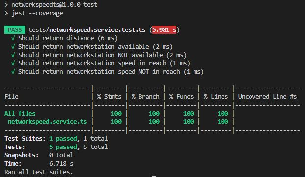

## NordCloud Tech assignment - Network speed

`TypeScript, .Node.js, Express`

`Visual Studio Code`

------

#### **How to run the solution** (Local Computer)

1. Install `Node.js`, Visual Studio Code and GIT.

2. Use git to clone a Git repository to a specific folder on your local machine. 

3. Start Visual Studio Code

   - **File** -> **Open Folder**

   - **View** -> **Terminal** ->
   1. Run `npm install` (install dependencies in `package.json`)
     2. Run `npm run dev` (run the application)

4. Start Browser: Firefox, Chrome or Edge.

   URL:  http://localhost:7000/GetNetworkSpeed

   **OR**
   
   URL:  http://localhost:7000/docs (Swagger UI)
   
   Click the **GET**, **Try it out** and **Execute** buttons (`/GetNetworkSpeed`).
   
   


The **response example** (response body). 

```json
{
  "result": [
    "Best network station for point 12,34 is 56,78 with speed 90",
    "No link station within reach for point 123,45"
  ]
}
```

**NOTE:** NOT AN ACTUAL RESPONSE. Run the application!

------

#### **Unit testing** (ts-jest) 

- Visual Studio Code-> **Terminal** -> **npm test**


Jest unit tests (`jest --coverage`).


---

#### Deploy App to Azure App Service

Manual Steps 

1. Azure Web Apps use IIS webservers that require a `web.config` file .  An example`web.config` (root directory) will use the `app.js` file as the Node.js application.

2. Run `npm run build` to compile the product build (`/dist` folder)

3. Copy the above `web.config` into root folder

4. Create an Azure Web App from the Azure portal. 

   ​	**Name:**  NetworkSpeed 

   ​	**Publish:**  Code

   ​	**Runtime stack:** Node 14? LTS 

   ​	**Operation System:** Windows 

   ​	**Region:** ***

5. Deploy the app to Azure 


After the deployment is complete. Navigate to the `https://<app>.azurewebsites.net/GetNetworkSpeed`

---

#### Additional Notes

###### TypeScript Development Workflow 

Notable packages

- `ts-node-dev` package: https://www.npmjs.com/package/ts-node-dev. Tweaked version of `node-dev` that uses `ts-node` under the hood. **It can significantly decrease the time it takes to restart your application when you make a change**.  

- `ts-node-dev` restarts a target `Node.js` process when any of the required files change. 

  

- Options 

  --`respawn`: Keep watching for changes after the script has exited.

  --`pretty`: Use pretty diagnostic formatter (TS_NODE_PRETTY).

  --`transpile-only`: Use TypeScript's faster transpileModule (TS_NODE_TRANSPILE_ONLY).
  
  


------

[^]: (C) HKuokkanen 15.1.2023. 